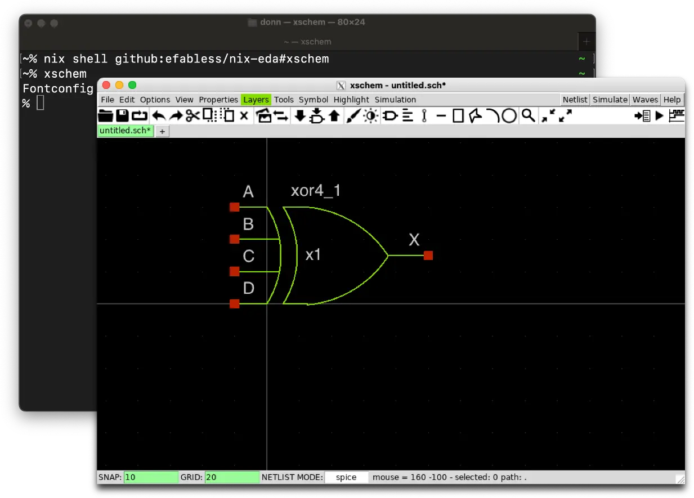

# ❄️ nix-eda



A [flake](https://nixos.wiki/wiki/Flakes) containing a collection of Nix
derivations for EDA (Electronic Design Automation) utilities, curated by
Efabless Corporation.

> nix-eda is not affiliated with the NixOS Foundation or any of its affiliates.

We compile and cache the tools for the following platforms:

| Platform | Nix System Name |
| - | - |
| Linux (x86_64) | `x86_64-linux` |
| Linux (aarch64) | `aarch64-linux` |
| macOS (x86_64) | `x86_64-darwin` |
| macOS (arm64) | `aarch64-darwin` |

## Tools Included
* [Magic](http://opencircuitdesign.com/magic)
* [Netgen](http://opencircuitdesign.com/netgen)
* [ngspice](https://ngspice.sourceforge.io)
* [KLayout](https://klayout.de)
    * (+ `.pymod` for Python module)
* [GDSFactory]
    * (+ `klayout-gdsfactory` as a shorthand for an environment with both installed)
* [Surelog](https://github.com/chipsalliance/Surelog)
* [Verilator](https://verilator.org)
* [Xschem](https://xschem.sourceforge.io/stefan/index.html)
* [Xyce](https://github.com/xyce/xyce)
    * Linux only.
* [Yosys](https://github.com/YosysHQ/yosys)
    * (+ `.pyosys` for Python module)
    * (+ some plugins that can be accessed programmatically)
    * (`yosysFull` for all plugins)

## Usage

### Directly

Before anything, if you haven't installed Nix using the
[OpenLane 2 documentation](https://openlane2.readthedocs.io/en/latest/getting_started/common/nix_installation/index.html),
make sure that:

1. You have Nix installed.
    * If not, see OpenLane 2's documentation on Nix-based installation linked
    above.
1. If you already have Nix installed, you have enabled the experimental Nix
   features `flakes` and `nix-command`.
    * If not, see this [this guide](https://nixos.wiki/wiki/Flakes#Other_Distros.2C_without_Home-Manager) for more info.
1. You have the OpenLane [Cachix](https://cachix.org) enabled.
    * If not, see the "If you already have Nix set up…" portion of the Openlane
    2 installation documentation linked above.

If you satisfy these conditions, you may use any of the tools by creating a Terminal shell with the tool as follows:

```sh
nix shell github:efabless/nix-eda#magic
```

then simply invoking `magic`. If you correctly set up the OpenLane cachix, you
won't have to build anything, but if you didn't, your computer will attempt to
build it.

You may also create a shell with multiple tools as follows:

```sh
nix shell github:efabless/nix-eda#{magic,xschem}
```

### As a dependency

To be documented, but you may refer to
[OpenLane 2](https://github.com/efabless/openlane2)
as an example of how to use this repository as a dependency. OpenLane 2 uses
this repository in addition to a number of other tools to provide a full
digital design environment.

Please note that the API for the functions provided in the Flake are not yet stable.

## ⚖️ License
The Apache License, version 2.0. See 'License'.


